# 智能云图库

作者: wjp

> 基于 Vue 3 + Spring Boot + COS + WebSocket 的企业级智能协同云图库平台。项目应用场景广泛，可作为表情包网站、设计素材网站、壁纸网站、个人云盘、企业活动相册等。用户可以在平台公开上传和检索图片素材；管理员可以上传、审核和管理分析图片；个人用户可将图片上传至私有空间进行批量管理、检索、编辑和分析；企业可开通团队空间并邀请成员，共享图片并实时协同编辑图片。技术栈包括 MySQL、Redis + Caffeine 多级缓存、COS 对象存储、Sa-Token 权限控制、WebSocket 实时通讯、JUC、Disruptor、AI 绘图大模型、设计模式等。

后端地址: https://github.com/wjp527/w-cloud-atlas-backend

该项目分为三个模块: 公开图库，私人图库，团队图库。用户可以在公开图库上传图片【一种是通过图片文件导入，另一种是通过url导入】，管理员可以进行审核和管理图片；以及实现批量导入图片的功能。在私人图库中，用户可以将上传的图片进行AI扩图，加水印的功能；实现颜色搜索。团队空间实现了成员协同合作，实时编辑图片的功能。并且配置了图片分析的可视化开发。

## 技术栈

### 前端:

- Vue3框架
- Vite打包工具
- Ant Design Vue组件库
- Axios请求库
- Pinia全局状态管理
- Echarts组件
- 前端工程化 ESLint + Prettier + TypeScript
- OpenAPI前端代码生成

### 后端:

- Java Spring Boot 框架
- MySQL数据 + MyBatis-Plus框架 + MyBatis X
- Redis缓存 + Caffeine 本地缓存
- COS对象存储
- Sa-Token 权限控制
- WebSocket实时通信
- Disruptor高性能无锁队列
- JUC并发和异步编程
- AI绘图大模型接入
- 多种设计模式的运用
- 性能优化
- 存储优化

## 效果图

### 首页

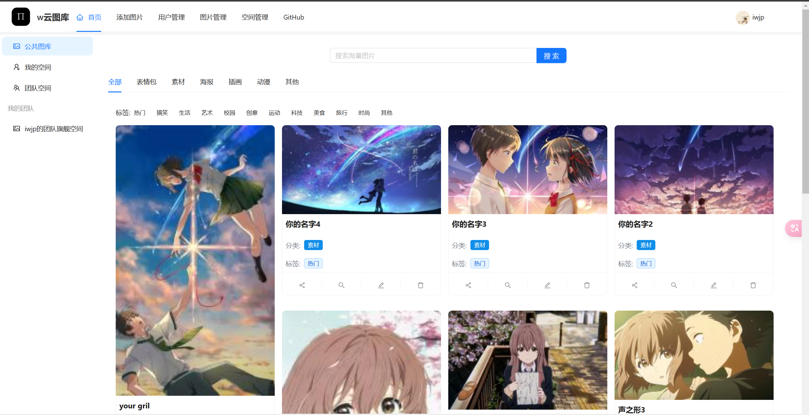

### 私有空间

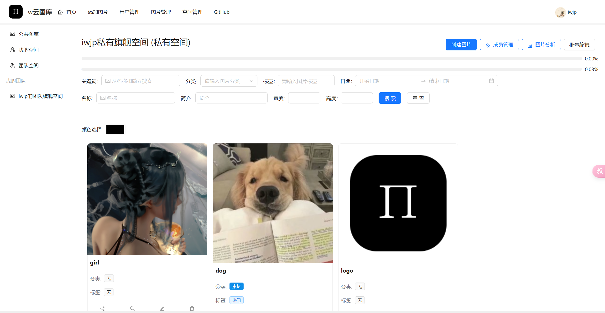

### 团队空间

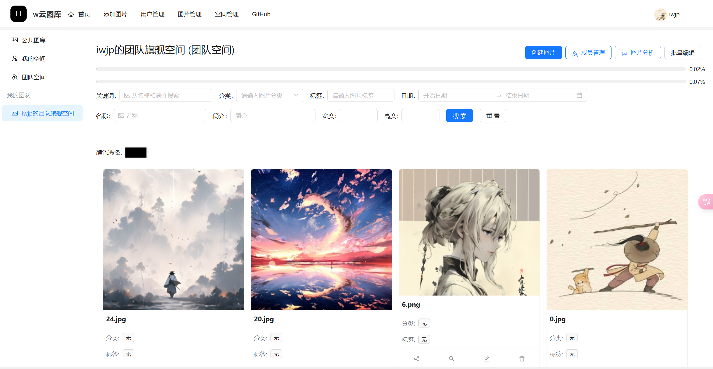

### 修改图片

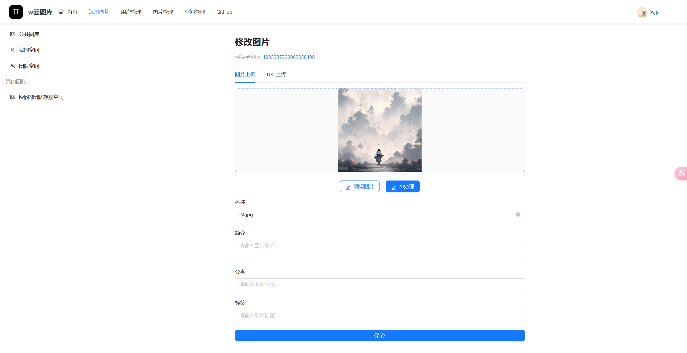

### AI功能

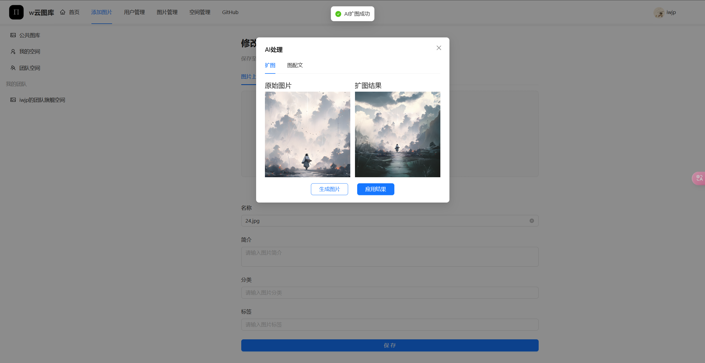

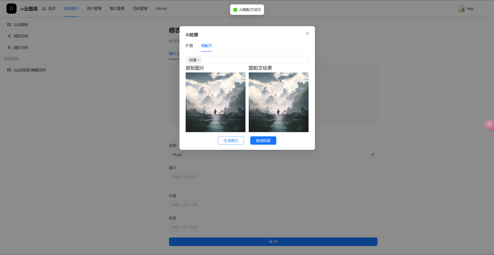

### WebSocket实时编辑

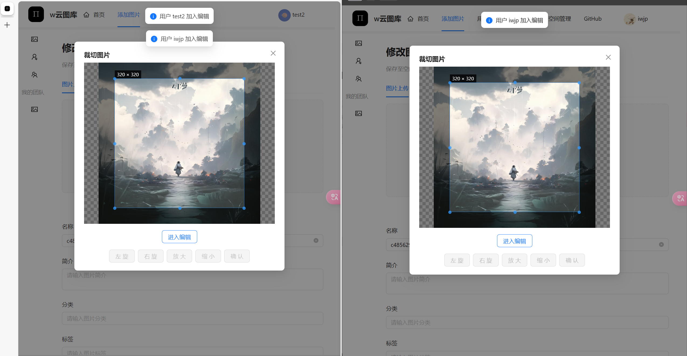

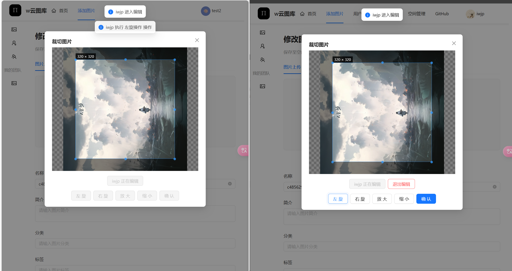

### 图片详情

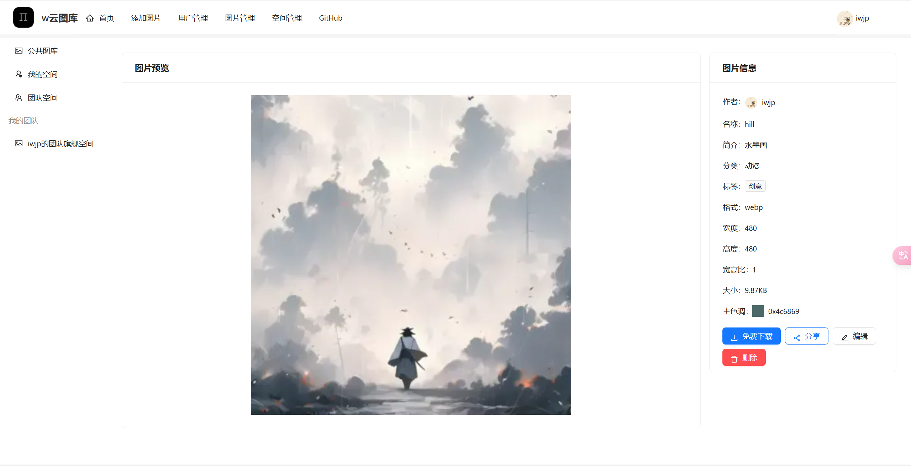

### 图片管理

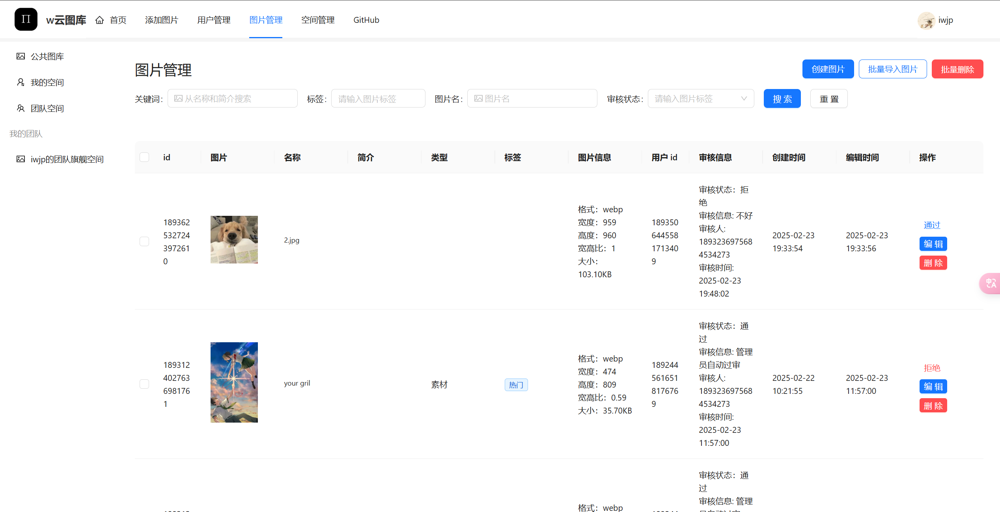

### 空间管理

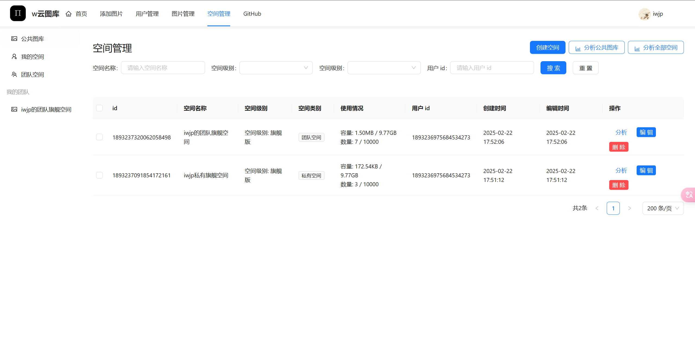
